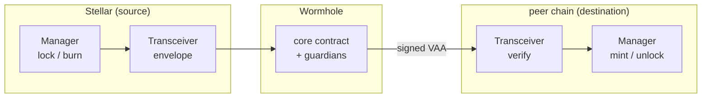
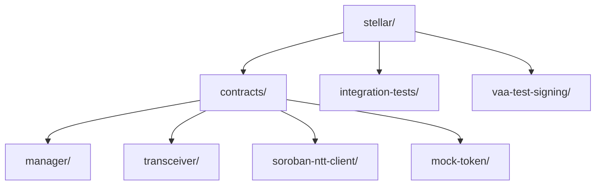
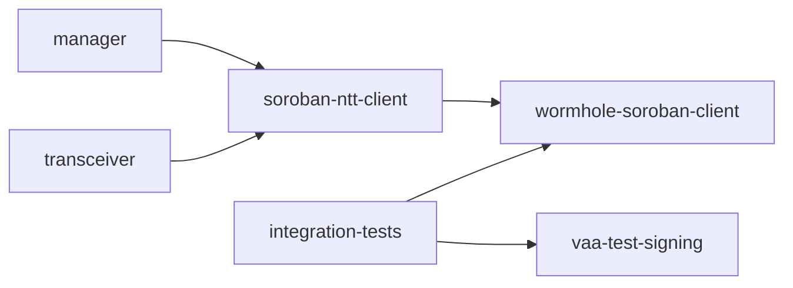

# Stellar NTT

A Stellar/Soroban implementation of Wormhole [Native Token Transfers (NTT)](https://wormhole.com/docs/products/token-transfers/native-token-transfers/). NTT moves a token across chains without wrapped assets and without liquidity pools: the issuer keeps their own native token on every chain, and a transfer changes which chain the supply sits on rather than minting a bridge derivative.

This workspace is the Stellar side of that protocol. It deploys the two NTT roles as Soroban contracts, a manager and a Wormhole transceiver, plus a shared library and test helpers. It speaks the same wire format as the EVM, Solana, and Sui implementations, so a Stellar deployment can peer with any of them.

## How a transfer works

The two roles split policy from transport. The manager custodies the token and enforces limits and thresholds; the transceiver carries the message over Wormhole.



1. A sender calls `transfer` on the manager, which locks or burns the token and hands an NTT message to every enabled transceiver.
2. The transceiver wraps it and posts it to the Wormhole core; the guardian network signs it into a VAA.
3. On the destination, a transceiver verifies the VAA and forwards it to the manager.
4. Once a threshold of transceivers attest, the manager mints or unlocks the token to the recipient.

Both directions are rate-limited, and transfers over the limit can be queued and completed after a window. Amounts are normalized to a shared 8-decimal precision on the wire, with any finer dust left on the sender.

## Repository layout



Dependencies between the crates:



| Crate                                                          | README                                           | Purpose                                                                                |
| -------------------------------------------------------------- | ------------------------------------------------ | -------------------------------------------------------------------------------------- |
| [`contracts/manager`](contracts/manager)                       | [README](contracts/manager/README.md)            | The policy layer: token custody, message sequencing, M-of-N attestation, rate limiting |
| [`contracts/transceiver`](contracts/transceiver)               | [README](contracts/transceiver/README.md)        | The transport layer: posts envelopes to the Wormhole core and verifies inbound VAAs    |
| [`contracts/soroban-ntt-client`](contracts/soroban-ntt-client) | [README](contracts/soroban-ntt-client/README.md) | The shared ABI: wire formats, types, errors, events, cross-contract interfaces         |
| [`contracts/mock-token`](contracts/mock-token)                 | [README](contracts/mock-token/README.md)         | A minimal token used as a test fixture                                                 |
| [`integration-tests`](integration-tests)                       | [README](integration-tests/README.md)            | On-chain end-to-end tests against a local Stellar network                              |
| [`vaa-test-signing`](vaa-test-signing)                         | [README](vaa-test-signing/README.md)             | Host-side guardian signing so tests can forge valid VAAs                               |

## Cross-chain compatibility

The protocol is only useful if Stellar's bytes match what peer chains produce. Three things are held in common with the reference implementations:

- **Magic prefixes:** the message prefixes (`0x994E5454` for a transfer, `0x9945FF10` for the transceiver envelope, and the two broadcast prefixes) are the canonical NTT values. A peer chain rejects anything else.
- **Wormhole chain id:** Stellar is chain **61**. Chain ids throughout the code are Wormhole chain ids, not native chain ids.
- **Decimal normalization:** amounts are trimmed to `min(8, source_decimals, destination_decimals)` before crossing, so a token held at different precisions on different chains still reconciles exactly.

The wire formats, byte for byte, are documented in the [shared library README](contracts/soroban-ntt-client/README.md#cross-chain-message-formats).

## Design decisions specific to Stellar

- **Address registry:** a Wormhole address is 32 raw bytes, but a Soroban `Address` is either a `G…` account or a `C…` contract, and the raw bytes do not distinguish them. The contracts identify addresses by `hash_address = keccak256(StrKey)` and resolve an inbound recipient through a registry on the Wormhole core. An unregistered recipient fails before the message is marked executed, so the transfer is retryable and no funds are lost. See the [manager README](contracts/manager/README.md#address-resolution).
- **Access control from OpenZeppelin:** ownership and pausing use the `stellar-access` and `stellar-contract-utils` libraries (two-step ownership, an owner-or-pauser split on pause). Auth failures surface as those libraries' error codes, not the NTT error enums.
- **Wormhole core:** the contracts call a Soroban port of the Wormhole core (the `wormhole-soroban-client` crate) for posting messages, verifying VAAs, and the address registry.

## Building and testing

Prerequisites: the Rust `wasm32v1-none` target and the `stellar` CLI. `soroban-sdk` is pinned to `25.3.0`, and release builds run with overflow checks on.

```sh
# build all crates
cargo build

# run the in-process unit suites (manager, transceiver, soroban-ntt-client)
cargo test --workspace
```

The integration tests are `#[ignore]`-gated and need Docker, so `cargo test --workspace` skips them. To run the end-to-end suite against a local network:

```sh
cd integration-tests
scripts/start-localnet.sh   # docker run the stellar/quickstart standalone network
scripts/fund-identity.sh    # create and fund the admin account
scripts/run-tests.sh        # build wasms, then run the ignored tests single-threaded
scripts/stop-localnet.sh
```

See the [integration-tests README](integration-tests/README.md) for what each step does and what the suite proves.

## Where to read next

Start with the [shared library README](contracts/soroban-ntt-client/README.md) for the wire formats and the cross-contract interfaces, since both contracts build on it. Then read the [manager](contracts/manager/README.md) for the transfer lifecycle, custody, threshold, and rate limiting, and the [transceiver](contracts/transceiver/README.md) for how messages reach and return from Wormhole.
