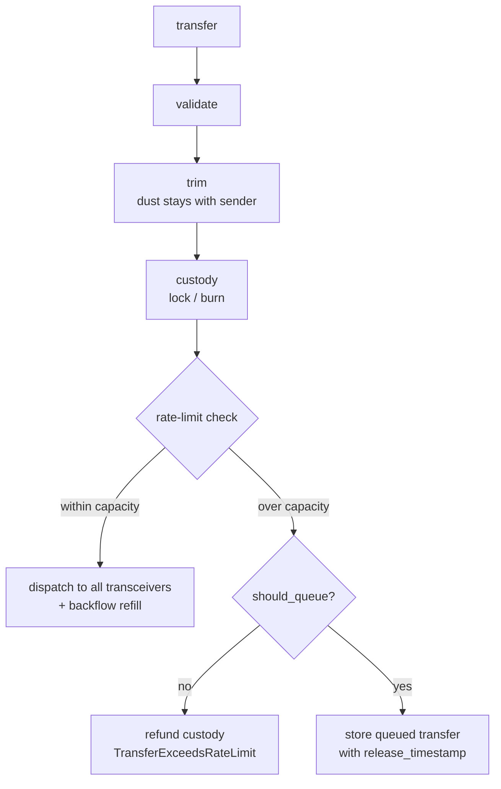

# NTT manager

The NTT manager is the Soroban contract that moves a native token across chains through Wormhole. It holds one token and does four things with it:

- **Custody** the token on send (lock or burn) and release it on receive (unlock or mint).
- **Sequence and dispatch** outbound messages to the registered transceivers.
- **Collect attestations** on inbound messages and execute once a threshold of transceivers agree.
- **Rate-limit** both directions, with a queue for transfers that exceed the limit.

One manager corresponds to one token but can drive up to 64 transceivers. It is the policy layer; the [transceiver](../transceiver) is the transport layer. Shared types, wire codecs, errors, and events come from [`soroban-ntt-client`](../soroban-ntt-client); the source files in [`src/`](src) hold only the manager's own logic.

Package `stellar-ntt-manager`, `#![no_std]`. This is a Stellar/Soroban port of Wormhole [Native Token Transfers](https://wormhole.com/docs/products/token-transfers/native-token-transfers/); the [workspace README](../../README.md) covers how the pieces fit together.

## Operating modes

The mode is fixed at deployment and determines how custody works.

| Mode      | On send            | On receive            | Where                                          |
| --------- | ------------------ | --------------------- | ---------------------------------------------- |
| `Locking` | lock (transfer in) | unlock (transfer out) | the canonical chain that holds the real supply |
| `Burning` | burn               | mint                  | spoke chains holding synthetic supply          |

```rust
pub enum Mode { Locking = 0, Burning = 1 }
```

The rule that conserves supply: if the source manager locks, the destination manager must burn-and-mint, and vice versa. Both sides locking, or both minting, breaks the accounting. Locking mode works with any token because it only calls `transfer`. Burning mode calls `burn` and `mint`, so the token must let the manager mint. See [`token_ops.rs`](src/token_ops.rs) for the exact calls; on a stock Stellar Asset Contract, burning mode requires the manager to be the token administrator.

## Address resolution

Wormhole carries every address as 32 raw bytes, but a Soroban `Address` is either a `G…` account or a `C…` contract, and the raw bytes alone do not say which. The manager therefore identifies Stellar addresses by `hash_address = keccak256(StrKey)` and resolves the inbound recipient through a shared registry on the **Wormhole core** contract, not locally.

- **Register once (per recipient):** before receiving, a recipient calls `record_address` on the Wormhole core, which stores `hash_address(addr) → addr`. It is permissionless and idempotent.
- **Outbound:** `sender`, `source_token`, and the advertised manager id are encoded with `hash_address`, one canonical, collision-free identity per address.
- **Inbound:** the manager resolves the message's `to` (a `hash_address`) back to the real `Address` via `get_address_from_hash` on the core. An unregistered recipient fails with `RecipientNotRegistered` (66) **before** the message is marked executed, so the transfer reverts and is safely retryable once the recipient registers. No funds are lost.

The manager learns the core address at construction (`__constructor(…, wormhole_core)`) and exposes it through `get_wormhole_core`.

## Transceivers, threshold, and peers

### Transceiver registry

The manager tracks transceivers in a `u64` bitmap, so it holds at most `MAX_TRANSCEIVERS = 64` of them. Each holds a permanent index:

```rust
pub struct TransceiverInfo { pub address: Address, pub enabled: bool, pub index: u32 }
```

- The manager assigns an index once and never reuses it; disabling a transceiver frees its bit in the enabled bitmap but keeps its index.
- The first registration sets the threshold to 1 automatically.
- The manager rejects removing the only enabled transceiver (`CannotDisableLastTransceiver`), and removing one that would leave the threshold above the enabled count lowers the threshold to match.

### Attestation threshold

An inbound message executes once enough enabled transceivers have attested:

```text
attested_count = popcount(attested_bitmap & enabled_bitmap)
approved       = attested_count >= threshold
```

Masking by the enabled bitmap means disabling a transceiver retroactively drops its vote. The manager enforces two invariants, named in the source and checkable permissionlessly through `validate_invariants`:

- **INV-023**: `threshold <= enabled_transceiver_count`
- **INV-024**: `threshold > 0` whenever any transceiver is enabled

### Peers

A peer is the NTT manager on another chain. Each peer carries its own inbound rate limit, so different source chains throttle independently.

```rust
pub struct NttManagerPeer {
    pub address: BytesN<32>,
    pub token_decimals: u32,          // 1..=18, used for amount normalization
    pub inbound_rate_limit: RateLimitParams,
}
```

`set_peer` rejects a zero chain id, this manager's own chain id, a zero address, and decimals outside 1 to 18. Re-registering a peer emits `PeerUpdated` with the old and new values.

## Rate limiting and backflow

Each direction is a token bucket:

```rust
pub struct RateLimitParams { pub limit: u64, pub current_capacity: u64, pub last_tx_timestamp: u64 }
```

Capacity starts full, drains by the trimmed transfer amount, and refills linearly over `RateLimitDuration` (default 86400 seconds). A transfer that exceeds the remaining capacity is either queued (if `should_queue`) or rejected. There are two independent buckets: one global outbound bucket, and one inbound bucket per peer.

**Backflow** couples them. A completed outbound transfer refills that peer's inbound bucket, and a completed inbound transfer refills the outbound bucket. This keeps ordinary bidirectional traffic from draining one direction and deadlocking users. Setting a new limit preserves the amount already consumed, so a limit change never mints or destroys capacity instantly.

## Outbound transfer flow

`transfer` (and `transfer_with_payload`) in [`outbound.rs`](src/outbound.rs), after `sender.require_auth()`:

1. **Validate:** amount must be positive, recipient non-zero, a peer must exist for the destination chain, and at least one transceiver must be enabled.
2. **Trim:** the amount is normalized to `min(8, local_decimals, peer_decimals)` decimals. The dust below that precision stays with the sender; only the trimmed-back amount is custodied.
3. **Custody:** lock (transfer in) or burn the trimmed amount, before the rate-limit check.
4. **Rate-limit check:** consume outbound capacity for the trimmed amount.
   - **Within capacity**: assign a sequence, build the `NttManagerMessage`, dispatch `send_message` to every enabled transceiver, refill the peer's inbound bucket (backflow), and return `TransferResult::immediate`.
   - **Over capacity, `should_queue = false`**: refund the custodied amount and return `TransferExceedsRateLimit`.
   - **Over capacity, `should_queue = true`**: store the queued transfer with a release timestamp, emit the queue events, and return `TransferResult::queued`. No dispatch and no backflow until it completes.



A queued outbound transfer completes permissionlessly through `complete_queued_transfer` once its release timestamp passes; it dispatches under the original sender and skips a second rate-limit check, because the delay already served that purpose. `cancel_queued_transfer` lets the original sender reclaim the funds, expanded back to local decimals, and works even while the contract is paused.

The message id is the sequence number placed in the low 8 bytes of a 32-byte field. The digest is `keccak256(source_chain || message)` (see the [wire formats](../soroban-ntt-client/README.md#message-digest)).

## Inbound and attestation flow

`attestation_received` in [`inbound.rs`](src/inbound.rs) requires `transceiver.require_auth()`, then:

1. **Authenticate the transceiver:** it must be registered and enabled, else `TransceiverNotRegistered` or `TransceiverNotEnabled`.
2. **Verify the peer:** the source chain and source manager must match a registered peer, else the attestation is rejected as spoofed.
3. **Record the vote:** parse the message, compute the digest, and set this transceiver's bit in the attestation bitmap. A repeat from the same transceiver is `TransceiverAlreadyAttested`. If the digest is already executed, emit `MessageAlreadyExecuted` and return, which makes late attestations idempotent.
4. **Check the threshold:** if `popcount(attested & enabled) < threshold`, return not-approved and wait for more.
5. **Execute:** at or above threshold:
   - target chain must match this manager's chain (`InvalidTargetChain`),
   - resolve the recipient hash to a real address through the Wormhole core (`RecipientNotRegistered` or `WormholeCoreCallFailed` on failure, both _before_ marking executed),
   - untrim the amount to local decimals,
   - consume inbound capacity for the source chain.

The manager marks the message executed in **both** the released and the queued branches, which is what prevents a replay from pushing a queued transfer's release timestamp forward. If capacity allows, release the tokens (unlock or mint), refill the outbound bucket (backflow), and emit `TransferRedeemed`. Otherwise store an inbound queued transfer for completion after the window.

Two permissionless entry points cover the tail cases. `complete_inbound_transfer` releases a queued inbound transfer after its window (the queue-entry removal is the replay guard, since the attestation is already marked executed). `execute_msg` retries an approved-but-unexecuted message; this is the path a recipient takes after they call `record_address`, since an unregistered recipient failed _before_ the executed flag was set.

## Public API

Signatures are exact. Owner-gated methods carry `#[only_owner]` and take no explicit caller argument; auth comes from the OpenZeppelin `Ownable` trait.

**Constructor**

```rust
__constructor(
    owner: Address,
    token: Address,
    mode: Mode,
    chain_id: u32,            // Wormhole chain id; 61 for Stellar
    outbound_limit: u64,
    rate_limit_duration: u64, // seconds, for example 86400
    wormhole_core: Address,   // used to resolve inbound recipients
)
```

**Ownership and pause**

| Method                                                                         | Auth            | Notes                                        |
| ------------------------------------------------------------------------------ | --------------- | -------------------------------------------- |
| `transfer_ownership` / `accept_ownership` / `renounce_ownership` / `get_owner` | OZ `Ownable`    | two-step transfer                            |
| `pause(caller)`                                                                | owner or pauser | emergency stop                               |
| `unpause(caller)`                                                              | owner only      | a compromised pauser can halt but not resume |
| `transfer_pauser(caller, new_pauser: Option<Address>)`                         | owner or pauser | `None` clears the role                       |
| `get_pauser() -> Option<Address>`                                              | anyone          |                                              |
| `upgrade(new_wasm_hash)`                                                       | owner           |                                              |

**Transceivers and threshold** (owner-gated setters)

`set_transceiver(transceiver) -> Result<u32>` (returns the assigned index), `remove_transceiver(transceiver)`, `set_threshold(threshold)`, plus views `get_transceiver_count`, `get_enabled_bitmap`, `get_transceiver_info(index)`, `get_threshold`, `validate_invariants`.

**Peers and rate limits** (owner-gated setters)

`set_peer(chain_id, peer_address, token_decimals, inbound_limit)`, `set_outbound_limit(limit)`, `set_inbound_limit(chain_id, limit)`, plus views `get_peer`, `get_outbound_limit_params`, `get_outbound_capacity`, `get_inbound_capacity(chain_id)`, `get_inbound_limit_params(chain_id)`, `get_rate_limit_duration`.

**Transfers**

```rust
transfer(sender, amount: i128, recipient_chain: u32, recipient: BytesN<32>, should_queue: bool)
    -> Result<TransferResult>
transfer_with_payload(sender, amount, recipient_chain, recipient, should_queue, additional_payload: Bytes)
    -> Result<TransferResult>
complete_queued_transfer(sequence: u64) -> Result<TransferResult>   // permissionless
cancel_queued_transfer(sender, sequence: u64) -> Result<()>          // original sender
```

**Inbound**

```rust
attestation_received(transceiver, source_chain: u32, source_ntt_manager: BytesN<32>, payload: Bytes)
    -> Result<AttestationResult>                                    // transceiver-authorized
execute_msg(source_chain, source_ntt_manager, payload) -> Result<AttestationResult>  // permissionless
complete_inbound_transfer(digest: BytesN<32>) -> Result<()>          // permissionless
```

**Queries** (all permissionless)

`quote_transfer(amount, recipient_chain) -> (trimmed, dust)`, `quote_delivery_price(recipient_chain) -> Vec<TransceiverFee>`, `is_message_executed`, `is_message_approved`, `message_attestations`, `transceiver_attested_to_message`, `get_attestation_info`, `get_next_sequence`, `get_mode`, `get_token`, `get_chain_id`, `token_decimals`, `get_version`, `get_wormhole_core`, and the queue views `get_outbound_queue_item` / `get_inbound_queue_item`.

`quote_delivery_price` makes one cross-contract call per enabled transceiver and reports each fee as `Option`, so one failing transceiver shows as `None` instead of failing the whole query.

## Storage model

`DataKey` is defined in [`state.rs`](src/state.rs). There is no `Admin`, `PendingAdmin`, or `Paused` key: ownership and pause state belong to the OpenZeppelin libraries under their own keys.

**Instance storage** (config and counters, TTL extended on every access)

| Key                 | Type              | Default                           |
| ------------------- | ----------------- | --------------------------------- |
| `Pauser`            | `Option<Address>` | none                              |
| `Token`             | `Address`         | required                          |
| `TokenDecimals`     | `u32`             | required (cached at construction) |
| `Mode`              | `Mode`            | required                          |
| `ChainId`           | `u32`             | required                          |
| `WormholeCore`      | `Address`         | required                          |
| `Threshold`         | `u32`             | 0                                 |
| `NextSequence`      | `u64`             | 1                                 |
| `Version`           | `u32`             | 1                                 |
| `TransceiverCount`  | `u32`             | 0                                 |
| `EnabledBitmap`     | `u64`             | 0                                 |
| `OutboundRateLimit` | `RateLimitParams` | unlimited if unset                |
| `RateLimitDuration` | `u64`             | 86400                             |

**Persistent storage** (per-entity, TTL extended on read and write)

| Key                         | Value                    |
| --------------------------- | ------------------------ |
| `Peer(chain_id)`            | `NttManagerPeer`         |
| `Transceiver(index)`        | `TransceiverInfo`        |
| `TransceiverIndex(address)` | `u32` (reverse lookup)   |
| `Attestation(digest)`       | `AttestationInfo`        |
| `OutboundQueue(sequence)`   | `OutboundQueuedTransfer` |
| `InboundQueue(digest)`      | `InboundQueuedTransfer`  |

TTL values are the shared `TTL_THRESHOLD` (about 1 day) and `TTL_EXTEND` (about 30 days) from [`soroban-ntt-client`](../soroban-ntt-client/src/constants.rs). The manager uses no temporary storage.

## Error codes

The `NttManagerError` enum lives in [`soroban-ntt-client`](../soroban-ntt-client/src/errors.rs), not in this crate. Discriminants are on-chain ABI.

| Range  | Category                                                                                 |
| ------ | ---------------------------------------------------------------------------------------- |
| 1–8    | Message encoding, decimals, chain-id, amount overflow                                    |
| 13     | `NotAdminOrPauser`                                                                       |
| 20, 30 | Uninitialized rate limit or state                                                        |
| 40–49  | Transceiver registry, threshold, transceiver-call failures                               |
| 50–55  | Peer registration and validation                                                         |
| 60–67  | Transfer flow, including `RecipientNotRegistered` (66) and `WormholeCoreCallFailed` (67) |
| 80–84  | Attestation and redemption                                                               |

Owner and pause failures are not in this enum. They come from the OpenZeppelin Stellar libraries: `OwnableError` (2100–2102), `RoleTransferError` (2200–2203), and `PausableError::EnforcedPause` (1000).

## Security

**No dedicated reentrancy guard:** the manager does not use a reentrancy flag or a transfer guard. Protection is structural: transfer entry points are gated by `#[when_not_paused]`, state changes follow checks-effects ordering, and the executed flag plus queue-entry removal are set around token release so a re-entered call finds the work already done.

**Replay protection:** each message has a digest that binds it to its source chain. Attestations are recorded per transceiver per digest, so no transceiver counts twice. The executed flag is set in both the released and queued inbound branches. `execute_msg` and repeat attestations are idempotent.

**Pausing:** `#[when_not_paused]` covers `transfer`, `transfer_with_payload`, `complete_queued_transfer`, `complete_inbound_transfer`, `attestation_received`, and `execute_msg`. `cancel_queued_transfer` is intentionally left uncovered so refunds work during a pause.

**Authorization**

| Operation                                                                                                  | Auth                                                         |
| ---------------------------------------------------------------------------------------------------------- | ------------------------------------------------------------ |
| `transfer` / `transfer_with_payload`                                                                       | `sender.require_auth()`                                      |
| `cancel_queued_transfer`                                                                                   | original sender                                              |
| `attestation_received`                                                                                     | `transceiver.require_auth()`, must be registered and enabled |
| owner setters, `upgrade`, ownership transfer                                                               | owner (OZ `Ownable`)                                         |
| `pause`                                                                                                    | owner or pauser                                              |
| `unpause`                                                                                                  | owner only                                                   |
| `complete_queued_transfer`, `complete_inbound_transfer`, `execute_msg`, `validate_invariants`, all getters | permissionless                                               |

## Modules

`src/` holds eight modules plus `lib.rs`:

| File                                     | Responsibility                                                            |
| ---------------------------------------- | ------------------------------------------------------------------------- |
| [`lib.rs`](src/lib.rs)                   | Contract struct, entry points, trait impls, constructor                   |
| [`state.rs`](src/state.rs)               | The `DataKey` enum                                                        |
| [`storage.rs`](src/storage.rs)           | Typed storage wrappers with TTL extension                                 |
| [`token_ops.rs`](src/token_ops.rs)       | Lock / unlock / burn / mint dispatch by mode; decimals query              |
| [`peers.rs`](src/peers.rs)               | Peer registry, per-peer inbound limit, backflow, peer verification        |
| [`transceivers.rs`](src/transceivers.rs) | Bitmap, registry add/remove, threshold, invariants                        |
| [`rate_limit.rs`](src/rate_limit.rs)     | Outbound consume/refill wrappers                                          |
| [`outbound.rs`](src/outbound.rs)         | Outbound transfer lifecycle                                               |
| [`inbound.rs`](src/inbound.rs)           | Attestation processing, threshold execution, inbound queue, `execute_msg` |

`Mode`, `NttManagerPeer`, `RateLimitParams`, the message codecs, the error enum, the events, and the constants are all defined in [`soroban-ntt-client`](../soroban-ntt-client) and re-exported, not defined here.

The in-process suite under [`tests/`](tests/) covers behavior, and [`integration-tests`](../../integration-tests) covers it end to end.
