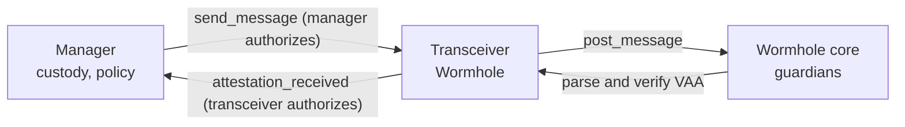

# NTT Wormhole transceiver

A transceiver is the transport adapter between a chain-local [NTT manager](../manager) and a remote chain. The manager owns policy: token custody, rate limits, attestation thresholds, and the peer managers it trusts. The transceiver owns transport: it carries the manager's opaque payloads over one specific messaging protocol and verifies the ones coming back.

This contract is the **Wormhole** transceiver. Its two jobs:

- **Outbound:** the manager calls `send_message`. The transceiver wraps the payload in a `TransceiverMessage` envelope and posts it to the Wormhole core contract, which the guardian network turns into a signed VAA.
- **Inbound:** anyone submits a VAA to `receive_message`. The transceiver has the Wormhole core verify the guardian signatures, checks the VAA came from the registered peer transceiver, guards against replay, decodes the envelope, and forwards the inner payload to its manager.

Package `stellar-ntt-transceiver`, `#![no_std]`. Message codecs, interfaces, errors, and events come from [`soroban-ntt-client`](../soroban-ntt-client); the source files here (`inbound.rs`, `outbound.rs`, `peers.rs`, `state.rs`, `storage.rs`, `lib.rs`) hold only the contract logic.

## The manager-transceiver trust boundary

Neither side trusts the other blindly. Each proves one half of the security property.

- On the way out, the transceiver checks `manager.require_auth()`. Without it, any caller could push forged payloads through this contract's Wormhole emitter.
- On the way in, the transceiver calls `attestation_received` with itself as the caller. The manager then authenticates it as a registered, enabled transceiver and applies its own threshold and rate limits.
- The transceiver's guarantee to the manager: "this came from a verified VAA, from the peer emitter registered for that chain." The manager's guarantee: "enough distinct transceivers attested, within limits."

The two contracts also reference each other's identity by `hash_address`, the keccak256 of a Soroban address's StrKey text. `get_manager_id` returns `hash_address(manager)`; that 32-byte value is what appears as `source_manager` outbound and is checked against `recipient_manager` inbound.

## Public API

Grouped by the trait that defines each method. Errors are [`TransceiverError`](../soroban-ntt-client/src/errors.rs).

**Constructor**

- `__constructor(owner, manager, wormhole_core)` stores the owner, the manager, and the Wormhole core, and sets version to 1.

**Ownership and pause** (OpenZeppelin `Ownable` / `Pausable`)

- Two-step ownership: `transfer_ownership`, `accept_ownership`, `renounce_ownership`, `get_owner`.
- `pause` / `unpause`, both owner-only.
- `upgrade(new_wasm_hash)`, owner-only.

**Views** (`TransceiverInterface`)

- `get_manager`, `get_manager_id`, `get_manager_token` (cross-calls the manager), `get_version`, `get_transceiver_type` (returns `b"wormhole"`).

**Outbound** (`TransceiverInterface`)

- `send_message(recipient_chain, recipient_manager, manager_payload)`. Manager-authorized, blocked when paused.
- `quote_delivery_price(recipient_chain)` returns the Wormhole core message fee as `i128`.

**Inbound and Wormhole management** (`WormholeTransceiverInterface`)

- `receive_message(vaa_bytes)`. Permissionless and blocked when paused; the guardian signatures are the authentication.
- `set_peer(chain_id, emitter)` (owner-only, one-shot) and `set_peer_enabled(chain_id, enabled)` (owner-only).
- `get_peer`, `get_peer_info`, `is_peer_enabled`, `is_vaa_consumed`, `get_wormhole_core`.
- `broadcast_id()` and `broadcast_peer(chain_id)`, permissionless, blocked when paused.

Auth in one line: manager-only for `send_message`; owner-only for pause, upgrade, and peer setters; everything else (views, `receive_message`, broadcasts, quote) is permissionless.

## Outbound: send a message

`send_message` in [`outbound.rs`](src/outbound.rs):

1. `manager.require_auth()`. Only the owning manager may send.
2. Load the peer for `recipient_chain`; it must exist and be enabled, else `PeerNotFound` or `PeerDisabled`.
3. Build `TransceiverMessage { source_manager: manager_id, recipient_manager, manager_payload, transceiver_payload: empty }` and serialize it.
4. Post to the Wormhole core via `post_message`, emitting the transceiver contract itself as the emitter.
5. Emit `MessageSent`.

The post uses a hardcoded nonce of `0` and consistency level `Confirmed` (not `Finalized`), a latency-versus-finality choice that applies to every message this contract sends. The core-assigned sequence is discarded locally; Wormhole tracks it.

Note that `recipient_chain` never enters the envelope. Cross-chain routing is implicit: the destination transceiver recognizes this contract by its peer registration for Stellar (chain 61), and the `recipient_manager` field names the manager that should consume the payload. `send_message` uses `recipient_chain` only to validate a peer exists and to label the event.

## Inbound: receive a VAA

`receive_message` in [`inbound.rs`](src/inbound.rs) runs these checks in order:

1. **Verify:** the Wormhole core parses and verifies the VAA (guardian signatures). Failure is `WormholeVerificationFailed`.
2. **Known peer:** load the peer for `vaa.emitter_chain`; `PeerNotFound` or `PeerDisabled` otherwise.
3. **Emitter match:** `peer.emitter` must equal `vaa.emitter_address`, else `UnexpectedEmitter`. This stops any other emitter on the source chain from spoofing the peer.
4. **Decode:** `TransceiverMessage::from_bytes`; `MessageTooShort` or `InvalidTransceiverPrefix` on failure.
5. **Recipient match:** `recipient_manager` must equal this contract's `manager_id`, else `UnexpectedRecipientManager`. This prevents one transceiver from consuming a message addressed to a different manager.
6. **Replay:** look up `(emitter_chain, emitter_address, sequence)`; if already consumed, `ReplayDetected`; otherwise mark it consumed.
7. **Forward:** call `attestation_received` on the manager with the decoded `manager_payload`. A manager rejection surfaces as `ManagerRejectedMessage`.
8. Emit `MessageReceived`.

The transceiver reads only four VAA fields: `emitter_chain`, `emitter_address`, `sequence`, and `payload`. Finality is trusted from the core's verification, so timestamp, nonce, and consistency level are not re-checked here.

## Peers

A transceiver peer is the sibling transceiver on another chain, keyed by chain id to a 32-byte emitter address (`PeerInfo { emitter, enabled }`). This is distinct from the manager's peers, which are the remote _managers_ and additionally carry token decimals and a per-chain inbound rate limit.

- `set_peer` validates a non-zero chain id and emitter, then registers the peer enabled. Registration is **one-shot**: a second write returns `PeerAlreadySet`. That is a deliberate security boundary, because overwriting the emitter would change which VAAs a chain authenticates against. To correct a mistake, redeploy the transceiver.
- `set_peer_enabled` flips the flag in place, keeping the address. Disabling a peer is a kill-switch that blocks that chain in both directions, since the same enabled check gates outbound and inbound.

## Replay protection

Consumed VAAs are tracked by the tuple `(emitter_chain, emitter_address, sequence)` in persistent storage. `receive_message` marks the tuple consumed **before** forwarding to the manager. Because a manager rejection reverts the whole transaction, that mark rolls back too, so a VAA that failed only because its recipient was not yet registered can be retried once the recipient registers. `is_vaa_consumed` exposes the flag read-only.

This is one of three independent replay guards in the system: the transceiver dedups VAAs here, the manager dedups by message digest and per-transceiver attestation bitmap, and the Wormhole core dedups governance VAAs.

## Accountant broadcasts

`broadcast_id` and `broadcast_peer` post the two encode-only payloads from [`soroban-ntt-client`](../soroban-ntt-client) (`WormholeTransceiverInfo`, `WormholeTransceiverRegistration`) to the Wormhole core for the Global Accountant to consume. Both are permissionless and the caller pays the post fee. `broadcast_id` reads the manager's mode, token, and decimals; any failure there is `ManagerQueryFailed`. `broadcast_peer` requires a registered peer for the chain.

## Storage

`DataKey` in [`state.rs`](src/state.rs):

| Key                                                  | Location   | Value                |
| ---------------------------------------------------- | ---------- | -------------------- |
| `Manager`                                            | instance   | manager `Address`    |
| `WormholeCore`                                       | instance   | core `Address`       |
| `Version`                                            | instance   | `u32`                |
| `Peer(chain_id)`                                     | persistent | `PeerInfo`           |
| `Consumed(emitter_chain, emitter_address, sequence)` | persistent | `bool` (replay flag) |

Instance TTL is bumped on every access; persistent entries extend their own TTL on read and write. Both use the shared `TTL_THRESHOLD` / `TTL_EXTEND` values.

## Errors

See the `TransceiverError` ranges in the [shared library README](../soroban-ntt-client/README.md#error-vocabularies). Owner and pause failures come from the OpenZeppelin libraries (`OwnableError` 2100–2102, `PausableError::EnforcedPause` 1000), not from `TransceiverError`.

## Notes for auditors

- **Consistency level is `Confirmed`, not `Finalized`**, on every outbound post. This trades finality for latency uniformly.
- **The transceiver is its own Wormhole emitter:** peer registrations on other chains must point at Stellar (chain 61) and this contract's 32-byte id.
- **`quote_delivery_price` returns only the core message fee:** there is no relayer leg, so the same fee is quoted for every destination chain.
- **`flatten_call` collapses both error layers to one variant:** a malformed VAA and a bad signature both surface as `WormholeVerificationFailed`; the underlying Wormhole error is not passed through.
- **Chain-id bounds are checked at the `lib.rs` boundary** (`validate_chain_id`) and the non-zero check again inside the peer logic.

Behaviour is covered by the in-process suite under [`tests/`](tests/) (against a mock core and mock manager) and end-to-end against a real vendored Wormhole core in [`integration-tests`](../../integration-tests).
