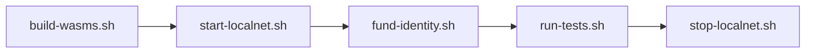

# integration-tests

End-to-end tests that deploy the whole NTT stack on a local Stellar network and drive it through the `stellar` CLI. Unlike the in-process suites under each contract's `tests/`, these run against a real Dockerized network and a real (vendored) Wormhole core, so they exercise guardian-signature verification, cross-contract auth, ledger-time rate-limit windows, and the actual deployed wasm.

The one place they use the in-process Soroban `Env` is as a host-side library: to serialize wire messages, compute digests, and hash addresses with the exact encoders the contracts use, so no byte layout is hand-rolled in the tests.

All tests are `#[ignore]`-gated, so a plain `cargo test --workspace` skips them on hosts without Docker. The opt-in runner is `scripts/run-tests.sh`.

## How it runs

The full cycle, driven by the scripts in [`scripts/`](scripts) and configured by `.env.localnet`:

| Script | What it does |
|--------|--------------|
| [`build-wasms.sh`](scripts/build-wasms.sh) | Deletes the prior release wasms, then `stellar contract build --optimize`. The deletion is deliberate: `--optimize` only runs `wasm-opt` on freshly compiled output, and a stale unoptimized manager wasm is oversized and rejected on upload. Asserts all four artifacts exist (three built plus the vendored core). |
| [`start-localnet.sh`](scripts/start-localnet.sh) | `docker run --rm -d -p 8000:8000 --name stellar_localnet stellar/quickstart:latest --standalone`, then polls RPC health and waits for the ledger to advance twice, so tests do not start against a stalled genesis ledger. |
| [`fund-identity.sh`](scripts/fund-identity.sh) | Registers the `localnet` network alias, generates the `admin` key if absent, and friendbot-funds it, retrying while friendbot warms up. |
| [`run-tests.sh`](scripts/run-tests.sh) | Absolutizes the wasm paths, rebuilds, then `cargo test -p integration-tests -- --ignored --nocapture --test-threads=1`. |
| [`stop-localnet.sh`](scripts/stop-localnet.sh) | Stops and removes the container. `--rm` means state is ephemeral: a fresh network every cycle. |

Tests run single-threaded on purpose. Every transaction originates from the one `admin` account, so parallel runs would collide on its sequence number and on the shared network.

Configuration lives in `.env.localnet` and is exported into every script. Key values: `STELLAR_CHAIN_ID = 61` (Stellar's Wormhole chain id), `SOROBAN_RPC_URL = http://localhost:8000/soroban/rpc`, the three built wasm paths under `target/wasm32v1-none/release/` plus the vendored core at `vendor/wormhole_core.wasm`, and `GUARDIAN_SECRET_HEX`, a localnet-only test guardian key.

## Harness modules

[`src/`](src) wraps the CLI and RPC in typed Rust so the tests read as protocol steps, not shell.

| Module | Role |
|--------|------|
| [`cli.rs`](src/cli.rs) | The single choke point for localnet interaction. Shells out to `stellar` for `deploy` / `invoke` and to `curl` for JSON-RPC. `try_invoke` parses the contract error number out of CLI stderr, so negative tests assert on exact error codes. |
| [`ctx.rs`](src/ctx.rs) | `TestContext`: localnet config, the resolved `admin` identity, wasm paths, and the guardian secret. `from_env` reads every env var (and panics if any is missing), resolves the admin address, and re-registers the network alias. |
| [`deploy.rs`](src/deploy.rs) | Typed deployers plus the `Stack` orchestrator, which deploys core, token, manager, and one transceiver, and exposes about forty helpers for registration, transfers, the queue lifecycle, pause, ownership, and balance checks. |
| [`vaa.rs`](src/vaa.rs) | Re-exports the [`vaa-test-signing`](../vaa-test-signing) primitives so `deploy.rs` and `messages.rs` use them unchanged. |
| [`messages.rs`](src/messages.rs) | Host-side wire encoders reusing the contract crates: `hash_address`, `build_inbound_vaa_hex` (serialize, sign, assemble), a tampered-signature variant, and `compute_message_digest`. |
| [`events.rs`](src/events.rs) | Typed wrapper over RPC `getEvents`. Because indexing lags ledger close, `find` polls until an event matches, and accessors decode topics and data so tests assert event shape without touching base64. |

**Lifecycle of one test:** `setup()` builds a `TestContext`, then `Stack::deploy` performs four real on-chain deploys (core, token, manager, transceiver). The test registers the transceiver (which auto-sets the threshold to 1) and the peer (on both the manager's and the transceiver's peer tables), funds a recipient, and for inbound tests registers that recipient on the core address registry. The body then builds a guardian-signed VAA off-chain, submits it, and asserts on balances and events. Negative tests use `try_*` helpers and assert `err.code`.

## Test coverage

Thirty tests across four groups. The single test binary is [`tests/run.rs`](tests/run.rs); shared fixtures are in [`tests/common/`](tests/common).

**admin** ([`tests/admin/`](tests/admin)) governance, access control, pause

| Test | Property |
|------|----------|
| `disable_last_transceiver_rejects` | cannot remove the only transceiver below the threshold invariant |
| `ownership_two_step` | two-step ownership re-gates owner-only methods under live auth |
| `pause_unpause` | pause blocks IO; pauser pauses, only owner unpauses |
| `register_peer_and_transceiver` | default state, auto threshold bump, peer persistence |
| `transceiver_disable_adjusts_threshold` | disabling a transceiver drops the threshold to stay within enabled count |
| `transceiver_ownership_two_step` | the transceiver has its own owner, independent of the manager |
| `transceiver_paused_blocks_io` | the transceiver's pause gate is independent and blocks both directions |
| `transceiver_threshold_changes` | N-of-M quorum enforced, threshold-change event emitted |

**inbound** ([`tests/inbound/`](tests/inbound)) the VAA receive path

| Test | Property |
|------|----------|
| `burning_mints` | burning inbound mints the untrimmed amount to the recipient |
| `locking_unlocks` | locking inbound releases custody to the recipient |
| `rate_limit_queues_then_completes_after_window` | over-limit inbound queues, then releases after the window |
| `receive_rejects` | tampered signature (20), unexpected emitter (35), wrong recipient manager (33), disabled peer (14) |
| `rejects_unregistered_peer` | manager-side peer check fires even when the transceiver peer is set |
| `rejects_unregistered_transceiver` | a rogue direct caller to `attestation_received` is rejected (40) |
| `replay_double_attest` | one transceiver cannot satisfy a threshold of 2 by attesting twice |
| `replay_executed_message` | a post-execution replay is idempotent, no double mint |

**outbound** ([`tests/outbound/`](tests/outbound)) transfer initiation

| Test | Property |
|------|----------|
| `burning_balances` | sender burned, manager stays at zero |
| `locking_balances` | sender debited, manager custody rises by the exact amount |
| `no_peer_rejects` | transfer to an unconfigured chain is rejected (50) |
| `queued_cancel_refunds` | cancelling a queued transfer refunds the sender in full |
| `queued_complete_after_window` | a queued transfer releases after the window |
| `rate_limit_rejects` | over-capacity without queue is rejected (62) with no custody leak |

**cross_cutting** ([`tests/cross_cutting/`](tests/cross_cutting)) properties spanning both paths

| Test | Property |
|------|----------|
| `chain_to_chain_round_trip` | custody out then release back leaves the manager at its initial balance |
| `decimal_trimming` | dust below the wire precision stays on the sender |
| `event_shapes_inbound` | `message_attested_to` and `transfer_redeemed` ABI shape |
| `event_shapes_outbound` | `transfer_sent` topics and data fields |
| `wasm_size_budget` | manager, transceiver, and mock-token stay under their size budgets |

## Vendored Wormhole core

[`vendor/wormhole_core.wasm`](vendor/) is the Stellar port of the Wormhole core, committed as a fixed binary so the harness has a deterministic thing to deploy. Provenance is recorded in [`vendor/WORMHOLE_CORE_README.md`](vendor/WORMHOLE_CORE_README.md): built from `NethermindEth/wormhole` branch `stellar`, commit `f379981…`, with the `stellar` CLI, then optimized.

The workspace also depends on the same repo as a git crate (`wormhole-soroban-client`) for host-side encoders. The wasm is vendored separately because the harness needs the compiled, optimized artifact to `stellar contract deploy`, and rebuilding a moving branch tip on every run would be slow and non-deterministic. Refreshing it means rebuilding from the pinned commit and updating the recorded commit, size, and toolchain.

## Prerequisites and gotchas

- **Docker** with the `stellar/quickstart:latest` image, port `8000` free, and no container already named `stellar_localnet`.
- **stellar-cli** on `PATH`. The whole harness shells out to `stellar` and `curl`.
- **The `wasm32v1-none` target** (the newer Soroban target), and `stellar contract build --optimize` output, or the network rejects the oversized manager on upload.
- **Env vars are mandatory:** `TestContext::from_env` panics if any is missing. Run through `scripts/run-tests.sh`, which sources `.env.localnet`; a bare `cargo test` without the env set panics immediately.
- **Ephemeral network:** the container runs with `--rm`, so each cycle starts from a clean ledger. Recipients must be re-registered on the core address registry each run before inbound can resolve their hashed `to`.
- **Flakiness is handled by polling, not sleeps:** friendbot warm-up, RPC indexer lag, and ledger-time rate-limit windows are all polled with timeouts (window tests treat `TransferNotReleasable` as "not yet"), so runs stay deterministic under load.
